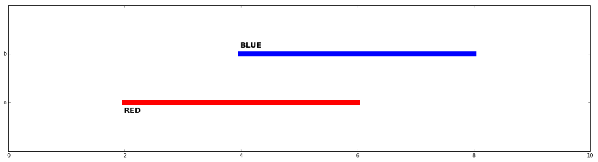
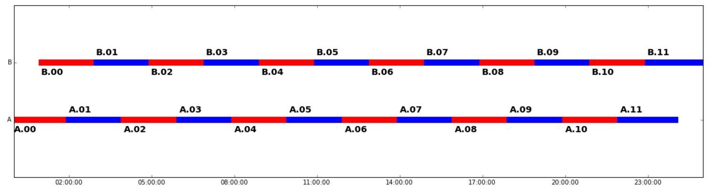

# chrony

Timeseries analysis tools with specific focus on timespans. Built on top of pandas.

## tldr

This library provides helpers for timespans manipulation using pandas objects. Let's consider the following DataFrame `df`.

    In [1]: df
    Out[1]: 
             beg        end
    0 2015-01-01 2015-01-02
    1 2015-01-02 2015-01-03
    2 2015-01-04 2015-01-05

### Chart timespans

    from chrony.charting import plot_events
    plot_events(
        categories=np.array(['a', 'b']),
        xmin=np.array([2, 4], dtype='d'),
        xmax=np.array([6, 8], dtype='d'),
        xlim=(0, 10),
        labels=['RED', 'BLUE']
    )

    df = pd.DataFrame({})
    df0 = pd.DataFrame({
        'ts_beg': pd.date_range('2015-10-02', freq='2h', periods=12),
        'ts_end': pd.date_range('2015-10-02T02:00:00', freq='2h', periods=12),
        'job': ['A.%.2d' % i for i in range(12)],
        'category': 'A'
    })
    df1 = pandas.DataFrame({
        'ts_beg': pd.date_range('2015-10-02T01:00:00', freq='2h', periods=12),
        'ts_end': pd.date_range('2015-10-02T03:00:00', freq='2h', periods=12),
        'job': ['B.%.2d' % i for i in range(12)],
        'category': 'B'
    })
    df = df.append(df0)
    df = df.append(df1)

    plot_events(
        categories=df['category'].values,
        xmin=df['ts_beg'].values,
        xmax=df['ts_end'].values,
        labels=df['job'].values
    )

### Describe the timespan

This following method gives a quick overview of your timespans:

    In [2]: describe_timespan(df['beg'], df['end'])
    Out[2]: 
    beg                           2015-01-01 00:00:00
    count                                           3
    contiguous transitions                          1
    not contiguous transitions                      1
    coverage                                     0.75
    end                           2015-01-05 00:00:00
    dtype: object

### Audit the timespan

The library gives you a `audit_timespan` function which raises an error if:

- beg or end columns have a timezone (due to https://github.com/pydata/pandas/pull/11410)
- Lengths of beg or end columns does not match
- Columns are not sorted
- There is overlap between timespans.

Check out tests for examples.

## Terminology

A **timespan** is a row of a `pandas.DataFrame` which represents a period of time between two fixed points. These are represented using a beg and a end column.

### Development

#### Tests

    nosetests chrony --with-coverage --cover-package chrony
