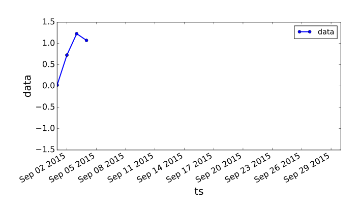
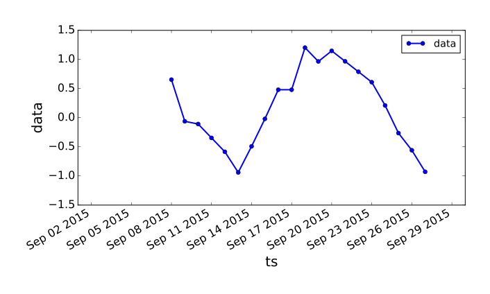

# timestamps

Diagnostic tool for timestamp-series. Built on top of pandas.

## tldr

timestamps is a toolbox to clean and process timestamp-series to extract information from them.

The functionalities are:

- **audit:** raise an error if the timestamp-series format is invalid.
- **describe:** give the main features of the timestamp-series.
- **fill_ts:** fills out missing dates.
- **fill_data:** fills out missing values.
- **trim:** removes the missing data at the beginning and end of a timestamp-series.
- **cut:** cuts a timestamp-series at each missing data period above a certain duration.

## timestamp-series representation

In this library, we will assume the following format for timestamp-series: 

- **ts (pandas Series with np.datetime64 format):** dates indexing the timestamp-series.
- **data (pandas Series):** values taken by the timestamp-series.

In most cases, ts and data will be columns of one same dataframe df, as in the following example (that we will use throughout this documentation).
 
 
		>>> df
	               ts      data
		0   0.022190 2015-09-01
		1   0.727421 2015-09-02
		2   1.229841 2015-09-03
		...
		27       NaN 2015-09-28
		28       NaN 2015-09-29
		29       NaN 2015-09-30		

Here is a plot of the timestamp-series (ts, data).		

## audit (ts, data)

**audit(ts, data)** will raise an error if one of the following rules is not satisfied by (ts, data):

- ts has a timezone.
- ts and data have different lengths.
- the timestep in ts is not constant.
- ts is not sorted.
- the series contains only missing data.

## describe (ts, data)

**describe** gives the main features of the timestamp-series.

	>> timestamps.describe(df.ts, df.data):
	beg                         2015-09-01 00:00:00
	time step                       1 days 00:00:00
	end                         2015-09-30 00:00:00
	# ts                                         30
	missing values                                9
	# holes                                       4
	min hole size                                 1
	1% percentile hole size                    1.03
	10% percentile hole size                    1.3
	25% percentile hole size                   1.75
	median hole size                              2
	75% percentile hole size                   2.25
	90% percentile hole size                    2.7
	99% percentile hole size                   2.97
	max hole size                                 3
	dtype: object

## trim (ts, data)

**trim** removes missing data at the beginning and end of (ts, data).

	>>> df = timestamps.trim(df.ts, df.data):
		
## fill_ts (ts, data)

**fill_ts** adds new lines in *ts* associated to missing values in *data* so that the timestep is constant in *ts* with no missing timestamp.

## fill_data (ts, data, max\_hole\_duration)

**fill_data** uses linear interpolation to fill holes which duration are lower than *max\_hole\_duration*.

	>>> df = timestamps.fill_data(df.ts, df.data,max_hole_duration=2):
	>>> print(df)
                  ts       data
		0   0.022190 2015-09-01
		1   0.727421 2015-09-02
		2   1.229841 2015-09-03
		...
		24 -0.264569 2015-09-25
		25 -0.559090 2015-09-26
		26 -0.929127 2015-09-27

Note that the initial timestamp-series has been trimmed (missing data at the end has been removed) and that all holes with length smaller or equal to two timesteps have been filled.

## cut (ts, data, min\_hole\_duration)

**cut** cuts the timestamp series into smaller ones, thus removing all holes with duration marger than *min\_hole\_duration*.

	>>> timestamps.cut(df.ts,df.data,min_hole_duration=2):
	[
	           data         ts
		0  0.022190 2015-09-01
		1  0.727421 2015-09-02
		2  1.229841 2015-09-03
		3  1.072509 2015-09-04
	,
		        data         ts
		0   0.653411 2015-09-08
		1  -0.062144 2015-09-09
		2  -0.108815 2015-09-10
		...
		17 -0.264569 2015-09-25
		18 -0.559090 2015-09-26
		19 -0.929127 2015-09-27
	]
	

